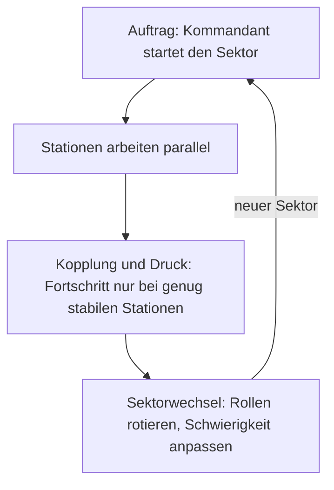
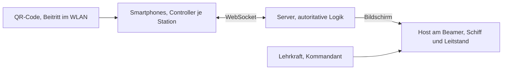

# Spieldesign des kooperativen Lernspiels

Arbeitsstand für die multimediale Modulprüfung Medientechnik (E-Phase). Dieses Dokument beschreibt Struktur und Mechaniken so weit, dass daraus ein erstes lauffähiges MVP entstehen kann. Es ist bewusst nicht vollständig: Stationen und Mini-Spiele sind jeweils an einem Beispiel ausgearbeitet, der Rest ist als Muster angelegt.

## 1. Überblick

Die Klasse navigiert gemeinsam ein Raumschiff durch ein Asteroidenfeld. Laptop und Beamer zeigen das Schiff, die Smartphones der Lernenden werden über einen QR-Code zu Steuerungsstationen. Jede Station steht für eine Funktion an Bord und enthält ein Mini-Spiel, das einen Unterrichtsinhalt aufgreift. Das Spiel tritt an die Stelle der klassischen Ergebnissicherung am Ende einer Unterrichtsreihe.

## 2. Lernziel und Einordnung

Das Spiel sichert behandelten Stoff, es führt ihn nicht ein. Die beiden ausgearbeiteten Mini-Spiele liegen in der Einführungsphase: der Tiefpassfilter in Themenfeld 2 (Filter und Verstärker), die logischen Gatter in Themenfeld 3 (Digitaltechnik). Die Lehrkraft spielt keine eigene Station, sondern führt als Kommandant und beobachtet, steuert und differenziert über den Leitstand.

## 3. Rollen und Stationen

Jede Person besetzt genau eine Station und bedient deren Mini-Spiel auf dem Smartphone. Mögliche Stationen:

- Antrieb: hält das Schiff in Fahrt
- Navigation: wählt den Kurs durch das Feld
- Schilde: wehrt Asteroiden ab
- Bordcomputer: logische Schaltungen (ausgearbeitetes Beispiel, siehe Abschnitt 10)
- Sensorik: Signalfilter (Tiefpass)
- Reaktor: verteilt Energie auf die Stationen

Schnelle Lernende erhalten eine Unterstützerrolle (Co-Pilot) und arbeiten einer ausgelasteten Station zu. Zwischen den Sektoren wechseln die Rollen, damit niemand dauerhaft am Rand steht.

## 4. Geteilte Schiffswerte

Drei Werte gelten für die ganze Gruppe und erzeugen den gemeinsamen Druck:

- Hülle: sinkt bei Asteroidentreffern, wenn die Schilde unten sind
- Energie: wird von den Stationen verbraucht und vom Reaktor verteilt
- Fortschritt: steigt nur, solange genug Stationen stabil laufen

## 5. Rundenablauf (Sektoren)

Das Spiel läuft in Echtzeit, die Lehrkraft taktet es in Sektoren. Ein Sektor wiederholt sich, bis das Ziel erreicht ist.



## 6. Mechaniken gegen Passivität und Wartezeit

- Kopplung: Das Schiff kommt nur voran, wenn mehrere Stationen zugleich stabil sind. Drei aktive Personen reichen nicht.
- Sichtbarer Leerlauf: Ein geteilter Wert sinkt, sobald eine Station unbesetzt bleibt. Untätigkeit trifft die ganze Gruppe.
- Aufgabenpool: Aufgaben werden dynamisch verteilt, statt feste Runden mit Wartezeit zu erzeugen.
- Unterstützerrolle: Wer schnell löst, hilft einer anderen Station, statt zu warten.
- Kommunikation: Weil Stationen voneinander abhängen, gehört das Ansagen von Ereignissen zur Aufgabe.

## 7. Adaptive Schwierigkeit

Jedes Mini-Spiel kennt drei Stufen. Die Lehrkraft setzt eine Grundschwierigkeit, das System justiert pro Station nach dem Tempo nach. Wer schnell löst, bekommt dichtere Aufgaben. Wer mehr Zeit braucht, erhält gestufte Hilfen. Die Stufen sind fachlich begründet (Beispiel in Abschnitt 10).

## 8. Technische Architektur

Browserbasiert mit WebSockets. Der Server hält den Spielzustand verbindlich, die Clients sind schlank.



Beitritt: Der Host startet einen Raum und zeigt einen QR-Code mit der Beitritts-URL (Server-Adresse im WLAN plus Raumcode). Das Smartphone öffnet die Seite und übernimmt eine Station.

Zustand: Der Server tickt mit fester Rate (etwa 10 Hz), aktualisiert die geteilten Werte, prüft die Kopplung und sendet Updates. Die Phones senden nur Eingaben, der Server bewertet sie.

Nachrichten (Auszug):

- Client an Server: `beitritt`, `stationswahl`, `eingabe`, `loesungsversuch`
- Server an Client: `zustand` (Host erhält die Gesamtansicht, das Phone seine Stationsansicht), `ereignis`

## 9. Mini-Spiel-Schnittstelle

Jede Station lädt ein Mini-Spiel-Modul, das eine gemeinsame Schnittstelle erfüllt. So lassen sich neue Mini-Spiele anstecken, ohne den Kern zu ändern.

```ts
interface MiniSpiel {
  id: string;                       // z. B. "bordcomputer"
  station: string;                  // Anzeigename der Station
  erzeugeAufgabe(stufe: 1 | 2 | 3): Aufgabe;
}

interface Aufgabe {
  prompt: string;                   // Einkleidung der Aufgabe
  render(container: HTMLElement): void;   // Controller-UI aufbauen
  pruefe(eingabe: Eingabe): Ergebnis;
}

interface Ergebnis {
  geloest: boolean;
  teiltreffer: number;              // 0..1, fuer Live-Feedback
  hinweis?: string;                 // optionaler Tipp
}
```

Bei einem gelösten Versuch meldet das Modul `geloest: true`. Der Server hebt daraufhin den Status der Station und passt die geteilten Werte an. Der Wert `teiltreffer` speist die Live-Rückmeldung, etwa den Anteil korrekter Zeilen einer Wahrheitstabelle.

## 10. Beispielstation: Bordcomputer (logische Gatter)

Einkleidung: „Das Schott darf nur öffnen, wenn beide Schlüssel stecken.“ Dahinter steht ein UND-Gatter. Die Alltagssituation macht das Ziel auch für ein Publikum ohne Fachhintergrund verständlich.

Mechanik: Der Controller zeigt zwei Eingänge A und B sowie eine Wahrheitstabelle mit den Spalten Ist und Ziel. Die Lernenden wählen das passende Bauteil, sodass die Ist-Spalte der Ziel-Spalte entspricht. Die Tabelle färbt jede Zeile sofort grün oder rot.

Schwierigkeitsstufen:

- Stufe 1: ein Gatter mit zwei Eingängen, das richtige Bauteil aus vier Optionen wählen
- Stufe 2: zwei Gatter hintereinander auf eine vorgegebene Tabelle bringen
- Stufe 3: aus der Zieltabelle die Schaltung ableiten und mit dem KV-Diagramm vereinfachen

Validierung: Das Modul vergleicht die erzeugte Wahrheitstabelle mit der Zieltabelle. Das ist deterministisch und ohne Sonderfälle prüfbar, was die Station als ersten MVP-Baustein eignet.

## 11. MVP-Umfang

Für den ersten lauffähigen Stand genügt:

- Beitritt per QR-Code in einen Raum im lokalen WLAN
- Host-Anzeige mit Schiff, den Werten Hülle und Fortschritt sowie dem Stationsstatus
- zwei bis vier Stationen, davon der Bordcomputer voll spielbar
- ein Mini-Spiel (Bordcomputer, Stufe 1) über die Schnittstelle aus Abschnitt 9
- Leitstand mit manuellem Auslösen einer Asteroidenwelle und einem Schieberegler für die Grundschwierigkeit

## 12. Offene Punkte

- Geräteausstattung und WLAN-Stabilität im Klassenraum
- Anzahl der Stationen im Verhältnis zur Klassengröße
- Barrierearmut (Farben nicht als alleinige Information, Schriftgrößen)
- Umfang der Erprobung und Form der Datenerfassung für die Reflexion
```
